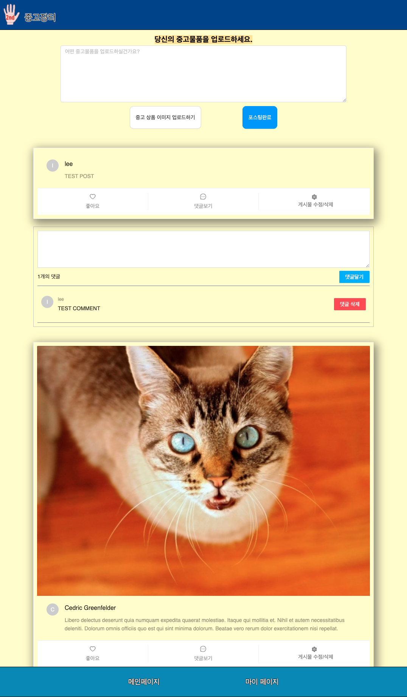
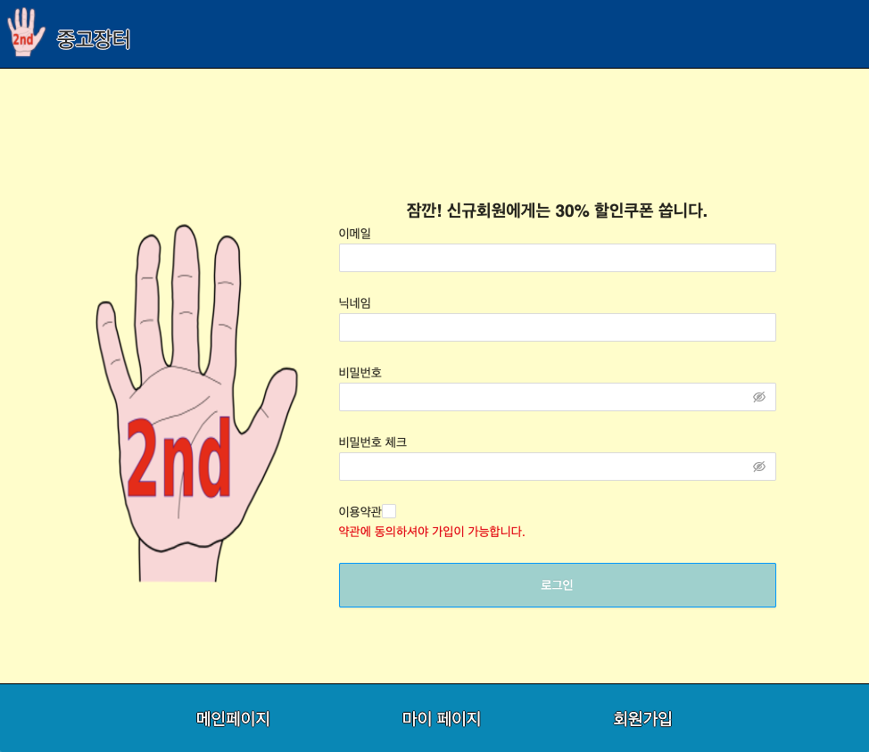

## \<SIDE PROJECT>

# **Buy and Sell used and vintage stuff**

  

# **Objectives**

- Next.js를 사용해서 기존에 CSR으로 구현된 어플리케이션이 가지고 있던 단점(초기 로딩시간 및 SEO 최적화)을 개선해서 웹 어플리케이션을 구현합니다.
- SSR과 CSR을 상황에 따라 적절하게 조합해서 사용할 수 있도록 연습합니다.
- SQL 데이터베이스를 사용하여 어플리케이션 내의 데이터간의 관계를 갖춰서 구성합니다.
- Back-End가 완성되지 않은 상태에서 우선 Front-End에서 Redux로 dummy data를 구성하여 개발을 진행합니다. (`실제 업무시에는 Back-End 개발자와 협의를 통해 dummy data로 구성한 상태 데이터의 기본 구조를 정한다는 가정으로 Front-End → Back-End 순으로 개발 진행`)
- 직접 개발한 어플리케이션을 AWS에 배포합니다.

# **The stack**

- ## Front-End
  HTML, CSS, JavaScript, React(+ Redux), Next.js
- ## Back-End
  NodeJS, ExpressJS
- ## Database
  MySQL, AWS EC2/S3
- ## Test
  Jest, RTL(React Testing Library)
- ## Branch management
  Git flow model로 branch 관리

# **Project Reflection**

<ins><b>Q1.&nbsp;이 프로젝트를 하게 된 배경은 무엇인가?</b></ins> 

→ 순수하게 React.js로 client side를 구현하게 되면, CSR이 되어 SEO(검색엔진 최적화)문제와 초기 로딩 시간 지연이라는 단점이 발생한다. 이러한 단점을 보완하기 위해서 적절하게 SSR과 CSR을 조합해서 프로젝트를 구성해야 된다는 것을 알게 되었고, 작지만 직접 프로젝트를 구성하면서 적용해보고자 본 프로젝트를 시작하게 되었다.

**[참고] 개인 블로그 :** [https://leehyungi0622.github.io/2021/04/26/202104/210426-SSR_and_CSR/](https://leehyungi0622.github.io/2021/04/26/202104/210426-SSR_and_CSR/)

<ins><b>Q2.&nbsp;무엇을 만들기 위한 목적으로 개발되었나요?</b></ins> 

→ 본 프로젝트의 목적은 `중고거래를 위한 커뮤니티`를 만들기 위함이다. 사용자들이 거래하고자 하는 중고거래 상품에 대해 포스팅을 하면, 관심있는 사용자들은 해당 포스팅에 대해 댓글을 달아 거래를 할 수 있도록 구성하였다.

<ins><b>Q3.&nbsp;이 프로젝트를 통해서 얻고자 하는 것과 개발경험에 있어, 어떤 부분이 도움이 되었는가?</b></ins> 

→ 우선 가장 도움이 되었던 부분은 성능개선이라는 측면에서 프론트엔드를 고려하여 개발을 해 볼 수 있었던 것 같다. 프론트엔드에서도 데어터를 핸들링해야 되는 경우가 많고, 서버로부터 받은 데이터를 효율적으로 프론트단에서 로드시켜서 사용자로 하여금 좀 더 나은 사용자 경험을 제공할때 비로소 의미있는 프론트엔드 개발을 할 수 있다고 느꼈다.
이외에도 사용에 있어, 익숙하지 않았던 redux-saga의 사용에 대해서 좀 더 익숙해질 수 있는 기회가 되었던 것 같다.

<ins><b>Q4.&nbsp;프로젝트 진행중에 예상치 못했던 어려움이 있었나?</b></ins> 

→ 있었다. 기존에 React에서 간단하게 사용했던 것들이 Next.js에서는 별도로 SSR을 위한 추가적인 설정이 필요했다.
예를들어, Next.js에서는 styled-components와 redux를 사용하기 위해서는 별도로 SSR을 위한 설정이 필요했고, 이에 대해서는 반복적인 학습이 필요하다고 느껴 개인 개발 블로그에 틈틈이 포스팅을 해두었다. 또한 Next.js의 버전 업데이트에 따른 설정에도 변화가 있기 때문에 정기적으로 공식 사이트를 보고 학습하는 습관을 들여야 겠다고 느꼈다.

**[참고]** [https://leehyungi0622.github.io/categories/NextJS/](https://leehyungi0622.github.io/categories/NextJS/)

# **Project Status**

🗓️ 2021.05.15(Sat)

**(1) Issue1) Client side 프로젝트 기본 구성하기**

→ [https://github.com/LeeHyungi0622/App-for-Buying-and-Selling-Used-Stuff/issues/1](https://github.com/LeeHyungi0622/App-for-Buying-and-Selling-Used-Stuff/issues/1)

**(2) Issue3) 로그인 컴포넌트 만들기**

→ [https://github.com/LeeHyungi0622/App-for-Buying-and-Selling-Used-Stuff/issues/3](https://github.com/LeeHyungi0622/App-for-Buying-and-Selling-Used-Stuff/issues/3)

**(3) Issue5) 회원가입 페이지 완성**

→ [https://github.com/LeeHyungi0622/App-for-Buying-and-Selling-Used-Stuff/issues/5](https://github.com/LeeHyungi0622/App-for-Buying-and-Selling-Used-Stuff/issues/5)

🗓️ 2021.05.16(Sun)

**(4) Issue7) Next.js에 Redux 기본 구성하기**

→ [https://github.com/LeeHyungi0622/App-for-Buying-and-Selling-Used-Stuff/issues/7](https://github.com/LeeHyungi0622/App-for-Buying-and-Selling-Used-Stuff/issues/7)

🗓️ 2021.05.25(Tue)

**(5) Issue10) Redux-saga middleware 적용하기**

→ [https://github.com/LeeHyungi0622/App-for-Buying-and-Selling-Used-Stuff/issues/10](https://github.com/LeeHyungi0622/App-for-Buying-and-Selling-Used-Stuff/issues/10)

🗓️ 2021.05.26(Wed)

**(6) Issue12) 로그인, 로그아웃 기능구현 (dummy data 활용)**

→ [https://github.com/LeeHyungi0622/App-for-Buying-and-Selling-Used-Stuff/issues/12](https://github.com/LeeHyungi0622/App-for-Buying-and-Selling-Used-Stuff/issues/12)

🗓️ 2021.05.31(Mon)

**(7) Issue9) 중고 상품 포스팅관련 컴포넌트 만들기**

→ [https://github.com/LeeHyungi0622/App-for-Buying-and-Selling-Used-Stuff/issues/9](https://github.com/LeeHyungi0622/App-for-Buying-and-Selling-Used-Stuff/issues/9)

🗓️ 2021.06.01(Tue)

**(8) Issue15) Immer 적용하기**

→ [https://github.com/LeeHyungi0622/App-for-Buying-and-Selling-Used-Stuff/issues/15](https://github.com/LeeHyungi0622/App-for-Buying-and-Selling-Used-Stuff/issues/15)

🗓️ 2021.06.02(Wed)

**(9) Issue17) Post의 Comment 추가 기능 구현**

→ [https://github.com/LeeHyungi0622/App-for-Buying-and-Selling-Used-Stuff/issues/17](https://github.com/LeeHyungi0622/App-for-Buying-and-Selling-Used-Stuff/issues/17)

**(10) Issue19) infinite scrolling 기능 구현**

→ [https://github.com/LeeHyungi0622/App-for-Buying-and-Selling-Used-Stuff/issues/19](https://github.com/LeeHyungi0622/App-for-Buying-and-Selling-Used-Stuff/issues/19)

# **Project Screen Shots**

**메인 페이지**

<table>
    <tr>
        <td width="50%">
            
        </td>
        <td width="50%">
            
        </td>
    </tr>
    <tr>
        <td align="center">메인 페이지</td>
        <td align="center">로그인 페이지</td>
    </tr>
    <tr>
        <td width="50%">
            
        </td>
        <td width="50%">
            
        </td>
    </tr>
    <tr>
        <td align="center">회원가입 페이지</td>
        <td align="center"></td>
    </tr>
</table>

# **Installation and Setup Instruction**
